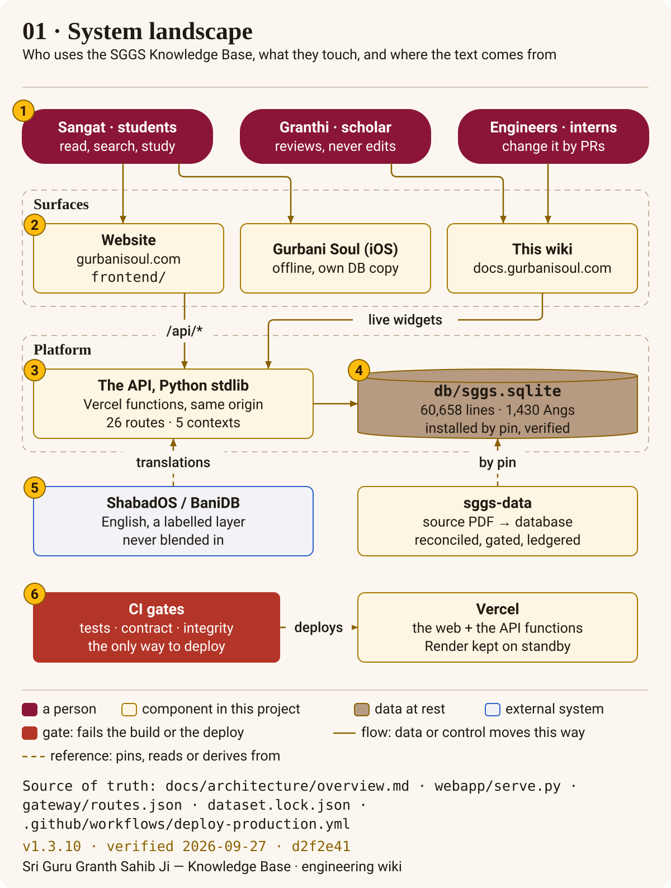

# Architecture

The system does one thing and is built around it: it shows **Sri Guru Granth Sahib Ji exactly as
printed**, cited by Ang, and proves at every step that nothing changed. Everything else — search,
verification, the insights, the app — is read-only around that text.

In three sentences:

- **Three repositories, joined by pins.** `sggs-data` builds the database from the source Bir and
  proves it character for character; this repository pins that exact database and serves it; the
  Gurbani Soul app pins the same database and this repository's golden contract.
- **One read-only API, five bounded contexts.** Reader, search, verify, insights and knowledge — each
  declares the tables it reads, runs as its own Vercel function (or all together), and opens SQLite
  read-only and immutable. The website and the wiki call it on the same origin.
- **Every deploy is gated and proven by commit.** Nothing reaches production except through CI, and
  production is re-checked against the pin every six hours.

## The pages

<!-- sggs:cards -->
- [The system on one page](overview.md) — who uses it, the containers across the three repositories, how production runs, the five data layers.
- [Request lifecycle](request-lifecycle.md) — one request from the browser to SQLite and back, in the order the code does it (poster 08).
- [Bounded contexts and the gateway](bounded-contexts-and-gateway.md) — the five contexts, how a function serves a slice of the database, and how routing is generated so it cannot drift (poster 09).
- [Three repositories and pins](three-repositories-and-pins.md) — every hand-off between data, platform and app as a reviewed lock file (poster 02).
- [Search waterfall](search-waterfall.md) — how a query becomes results, tier by tier (poster 05); part of [Search & verification](../search/README.md).
- [The insights context](insights-context.md) — theme networks, author and raag emphasis, Vaars and related verses: every number precomputed, descriptive only.
- [The knowledge context](knowledge-context.md) — raag-timing claims credited to their sources, disagreement kept, and forms taken only from headings.
- [The website](website.md) — a static Astro site with no framework runtime, two layouts, and the API on the same origin.
- [Security and privacy](security-and-privacy.md) — the defences at each layer, what is collected about readers, and the known gaps.
- [Quality and observability](quality-and-observability.md) — each quality, how it is measured and gated, how production is watched, and what is not yet wired.
- [Microservices roadmap](microservices-roadmap.md) — how the monolith became modules, then functions, and what is left.

## Read next

The decisions behind this shape are the [ADRs](../adr/README.md) — especially three repositories
([ADR-0007](../adr/0007-three-repositories.md)), the dataset by pin
([ADR-0008](../adr/0008-dataset-by-pin.md)) and the API as functions
([ADR-0011](../adr/0011-api-as-functions-in-the-web-project.md)). How the text is kept whole end to
end is [the integrity chain](../data/integrity-chain.md).
