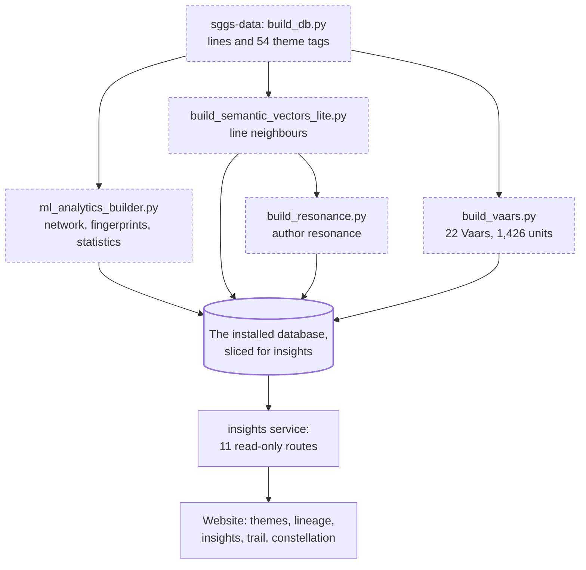

# The insights context

The insights context answers questions *about* the Granth rather than returning its text: which
themes appear together, what a Guru's writing emphasises, how a Vaar is built, which verses read
alike. Nothing is computed while you wait. Every number is precomputed by sggs-data's rebuild
pipeline and stored in the database; the service (`webapp/sggs/insights.py`) only reads it.

Two rules shape everything here:

- **Descriptive, never a ranking.** Every response carries a `note` saying so, and the site
  presents the numbers as emphasis or association, never as worth.
- **The Gurmukhi is never scored.** The analytics run on structure (Ang, raag, author,
  composition), the 54 curated theme tags, and the labelled English translation. No generic
  sentiment model is used; the build record in `analytics_meta` says why (such models mislabel
  devotional lines).

## What it answers

| Route | The question | Main tables |
|---|---|---|
| `/api/themes/network` | Which themes occur in the same shabads, beyond chance? | `theme_network` |
| `/api/analytics/author` | What does one voice emphasise, and how does its English translation read? | `author_analytics`, `theme_fingerprint`, `author_distinctive_terms` |
| `/api/analytics/raag` | The same, for a raag | `raag_analytics`, `theme_fingerprint` |
| `/api/analytics/progression` | How do a raag's main themes rise and fall in reading order? | `lines`, `concept_lines` |
| `/api/analytics/resonance` | Whose lines land nearest whose, relative to their share of the Granth? | `authors`, `author_resonance` |
| `/api/analytics/vaars` | The 22 Vaars: span, pauris, saloks, and who wrote each part | `vaars` |
| `/api/analytics/vaar?id=` | One Vaar's salok-and-pauri sequence | `vaars`, `vaar_units` |
| `/api/analytics/constellation` | Verses carrying one theme, grouped by the theme they share next | `concepts`, `concept_lines`, `lines` |
| `/api/related?comp_id=` | Compositions with the most similar theme profile | `shabad_neighbors` |
| `/api/line_concepts?ids=` | The theme tags on a set of lines (the Study Trail) | `concept_lines` |
| `/api/neighbors?line_id=` | Lines whose English meaning is closest | `line_neighbors`, `translations` |

Parameters, limits and response shapes are in the generated [API reference](../api/routes.md).

## Where the numbers come from

| Table | Built by (sggs-data `pipeline/`) | Method, in one line |
|---|---|---|
| `concepts`, `concept_lines` | `build_db.py` | 54 curated themes; 62,221 tags on 35,060 lines |
| `theme_network` | `ml_analytics_builder.py` | PPMI and Jaccard over shabad co-occurrence; 2,528 directed edges |
| `theme_fingerprint` | `ml_analytics_builder.py` | Lift of each theme for an author or raag against the whole Granth |
| `author_analytics`, `raag_analytics` | `ml_analytics_builder.py` | Counts plus stylometry on the English translation; 29 authors, 31 raags |
| `shabad_neighbors` | `ml_analytics_builder.py` | IDF-weighted theme-profile cosine; top 10 for each of 4,380 compositions |
| `line_neighbors` | `build_semantic_vectors_lite.py` | Exact sparse TF-IDF cosine on the English; 532,227 pairs, floor 0.30 |
| `author_resonance` | `build_resonance.py` | Lift of cross-voice neighbour edges; 533 pairs |
| `vaars`, `vaar_units` | `build_vaars.py` | Vaars found by their title headers; 22 Vaars, 1,426 units |

Why these methods:

- **PPMI, not raw counts.** A very common theme co-occurs with everything; PPMI measures
  co-occurrence beyond what the two themes' frequencies predict. Jaccard is kept alongside it.
- **Lift, not share.** A theme fingerprint compares an author's rate for a theme with the Granth's
  rate, so a large body of work does not dominate by size alone.
- **Stylometry reflects the translation.** Measures such as vocabulary richness (`mattr_100`) are
  computed on Dr. Sant Singh Khalsa's English, so they describe the translation as much as the
  original. Authors with too little text are flagged (`is_reliable = 0`); only 7 of the 29 meet
  the threshold.
- **Line neighbours are lexical.** The response's `note` still says "embedding cosine", but the
  current build's `source` field is `tfidf-exact-cosine-lite`: sparse TF-IDF over the English,
  headings excluded, verbatim twins removed. Read `source`, not the note. Full sentence
  embeddings remain a separate upgrade; if `line_neighbors` is absent, the route falls back to
  composition-level theme neighbours and says so (`level: "composition"`).

The concept count in `analytics_meta`'s `scripture_touched` text still says 53; it predates the
split of one theme into two, which made it 54.

## How the service behaves

- **Read-only and declared.** The module's `TABLES` set lists the 17 tables it may read.
  `webapp/tests/test_declared_tables.py` runs every insights route under an SQLite authorizer
  that refuses anything else, and the insights service's database slice is cut from the same
  list ([bounded contexts and the gateway](bounded-contexts-and-gateway.md)).
- **Degrades instead of failing.** Each route catches a missing table (`sqlite3.OperationalError`)
  and returns an empty result with a note such as "analytics tables not present in this DB
  build", so a database without the analytics layer still serves the reader and search.
- **Bounded input.** Every integer goes through `_int()` with a range; `min_ppmi` and `min_lift`
  are clamped, and a non-finite value (`NaN`, `inf`) is replaced by the default before clamping;
  `line_concepts` accepts at most 300 ids; the constellation returns at most 9 groups of 40
  verses. SQL is parameterised; the only built strings are `?` placeholder lists.
- **Scripture passes through verbatim.** Routes that return verses (`constellation`, `related`,
  `neighbors`) return the stored `gurmukhi` unchanged; the English comes from the labelled
  translation layer through `attach_translations`.

## Changing it

An analytics change is a dataset change: it lands in sggs-data (a builder, then a rebuild with the
scripture gates), reaches this repository as a `dataset.lock.json` bump, and is proven by the
golden contract, which replays insights routes such as `themes/network` at fixed parameters. See
[the three repositories and their pins](three-repositories-and-pins.md) and the
[dataset pin](../data/dataset-pin.md). A change to a route's shape or wording is a platform change
and follows the normal [release process](../process/release.md).
