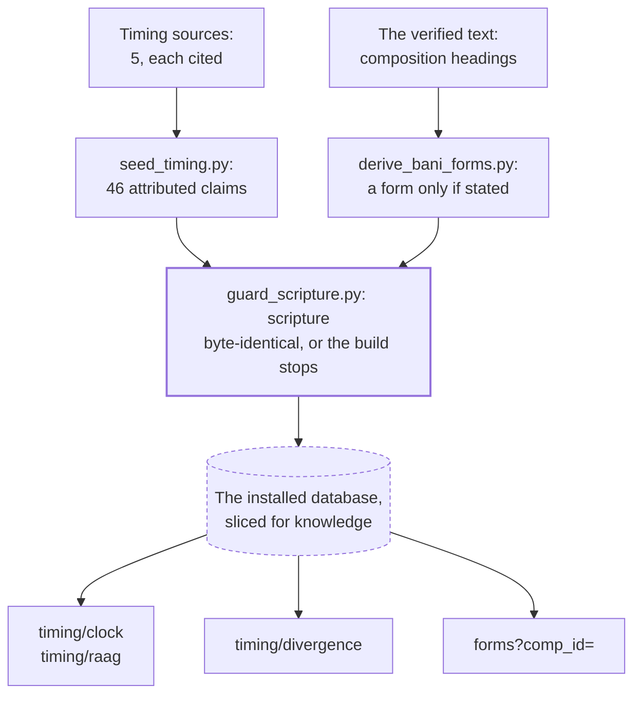

# The knowledge context

The knowledge context holds scholarship *about* the Granth that is not in the printed text. It
has two parts:

- **Raag timing.** When in the day or season each raag is traditionally sung. The website's raag
  clock and divergence pages read it.
- **Composition forms.** What a composition's own heading says it is: a pauri, a salok, an
  ashtpadi, which ghar, whether it has a rahao.

Both follow one rule: **record what a source says, never decide what is true.** Timing is stored
as attributed claims with a citation each, and disagreement between traditions is kept side by
side. A form is recorded only when the heading states it; otherwise the field stays empty. The
service is `webapp/sggs/knowledge.py`; the tables are built by sggs-data's `pipeline/timing/`.

## Raag timing

### What is stored

| Table | Holds |
|---|---|
| `timing_sources` | 5 sources, each with a tradition (`gurmat_sangeet` or `hindustani`), a URL where one exists, and notes on where it came from |
| `raag_timing_claims` | 46 claims over the 31 raags, each tied to a source (`NOT NULL`) |

Each claim has a `claim_type`:

| Type | Count | Meaning |
|---|---|---|
| `primary` | 32 | The main placement in a tradition |
| `variant` | 5 | A different placement recorded by another source |
| `seasonal` | 2 | A raag tied to a season rather than an hour |
| `ceremonial` | 7 | A liturgical or ceremonial use |

`confidence` is `consistent` (sources agree), `majority` (the dominant placement where variants
exist) or `disputed` (a recorded disagreement). Sources that could not be tied to a verifiable
publication are labelled "(compiled)" and their notes say where they came from. No citation is
invented.

### The pahar convention

A pahar is a three-hour watch. Claims store pahars 1 to 8 counted from 6 AM: pahar 1 is
06:00–09:00 and pahar 8 is 03:00–06:00. **Pahar 7 (00:00–03:00) deliberately has no raags**, and
the clock shows that silence as content rather than as a gap. The fixed-clock reading is a
rendering choice; traditionally the watches follow sunrise and sunset.

### The routes

- `/api/timing/clock` returns every claim grouped by type, the pahar convention, and the note
  "divergence is preserved, never adjudicated". The claims change only with a dataset, so the
  response is cached in the process (`core._TIMING_CACHE`) after the first request.
- `/api/timing/raag?name=` returns one raag's claims. It accepts the raag's Gurmukhi name or its
  roman name; an unknown name returns an empty list with the note "no such raag", and a missing
  `name` is a 400.
- `/api/timing/divergence` lists the raags where sources disagree, with every claim and its
  citation. Currently 5 raags qualify.

**What counts as a divergence.** A raag qualifies if it has a `variant` claim, or if two
*different* sources place it in different pahars. One source giving a raag a span across two
pahars is an extension, not a disagreement, and does not qualify. The query encodes this
(`COUNT(DISTINCT source_id) > 1`), so the page never shows a source disagreeing with itself.

## Composition forms

### What is stored

Four tables keyed by `comp_id`, one row per composition (4,527):

| Table | Holds | Stated for |
|---|---|---|
| `shabd_raag_map` | The raag, first Ang and first line of the composition | every composition |
| `shabd_structural_form` | `form` (pada, ashtpadi, solahe, chhant, vaar, pauri, salok) and `pada_count` | 1,378; the other 3,149 are `NULL` |
| `shabd_musical_markers` | `ghar` (1–17), `partaal`, `has_rahao`, `has_rahao_dooja`, `dhunni`, `jati` | ghar on 403, rahao on 2,525, partaal on 17 |
| `shabd_poetic_genre` | A named genre stated in the heading (`barah_maha`, `bavan_akhri`, …) | 57 |

Every row carries a `source_label` recording which heading it came from.

### The rules

`derive_bani_forms.py` in sggs-data reads the verified text and applies these rules:

- **Only a title-like heading counts.** A composition's first line is sometimes verse, so matching
  applies only to headings that carry a Mahala marker, a raag name, or a title word.
- **`comp_type` is never trusted alone.** That pipeline column is known to be mislabelled (see
  [known issues](../engineering/known-issues.md)); it is kept only as a hint inside
  `source_label`.
- **Matching is on NFC-normalised text.**
- **Anything unmatched stays `NULL` and is counted in the build report.** `NULL` means "the
  heading does not say", not "unknown to us, fill in later".

`/api/forms?comp_id=` joins the four tables for one composition. It returns `forms: null` for a
`comp_id` that has no row (the id gaps are permanent, see the [line record](../data/line-record.md)),
and a 400 when `comp_id` is missing or 0.

## Guarantees

- **Scripture is untouched.** The timing layer's migration runs only `CREATE TABLE` and `CREATE INDEX`
  statements for the tables it adds, and aborts on anything else. Every writer checks a committed baseline (row counts, data and schema hashes of
  every pre-existing table) before and after it runs, and `guard_scripture.py` is the standing
  gate in the rebuild.
- **Read-only and declared.** The module's `TABLES` lists exactly the seven tables it reads, and
  the service's database slice is cut from that list; `webapp/tests/test_declared_tables.py`
  refuses any other read ([bounded contexts and the gateway](bounded-contexts-and-gateway.md)).
- **Degrades instead of failing.** Without the timing layer, each route returns
  `available: false` rather than an error.
- **Tested end to end.** The golden contract replays the clock, every raag with claims (by both names),
  the divergences, and one composition per form and genre, so a dataset that changes any of them fails CI until the change is
  intended and re-baselined.

## Changing a claim

A new source, a corrected time or a new variant is a dataset change. Add it to sggs-data's
`pipeline/timing/timing_seed.json` with its citation, rebuild, and bring it here with a
`dataset.lock.json` bump ([the three repositories and their pins](three-repositories-and-pins.md)).
Never replace an existing claim because another source disagrees: add the second claim as a
`variant`, and the divergence page will show both.
