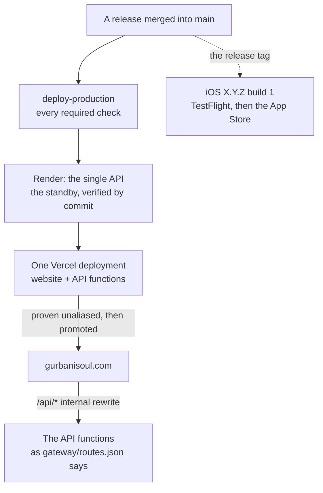

# Architecture Overview

The whole system on one poster — press *Next* on the site to build it up step by step:

## System context (C4 level 1)

Poster 01 above is the system context: three kinds of people, three surfaces, one read-only API,
the pinned database, the source Bir and the labelled English layer, and CI as the only way to
production.

## Containers (C4 level 2)

The containers live in three repositories joined by reviewed lock files — the data repository
builds and proves the database, this one pins and serves it and publishes the golden contract, the
app vendors both at a release:

## Deployment (production)

The web frontend and API are **same-origin**: the browser calls `/api/*` and Vercel's internal
rewrites send those paths to the API, which runs as Python functions in the same Vercel project
([ADR-0011](../adr/0011-api-as-functions-in-the-web-project.md)). There is no CORS and the frontend
carries no API-base configuration. `gateway/routes.json` decides the routing per environment:

- **Staging** routes each of the five bounded contexts (`reader`, `search`, `verify`, `insights`,
  `knowledge`) to its own function, with `all` — the whole API — as the catch-all.
- **Production today (v1.3.10)** answers every `/api` path with `all`.
- **From the release after 1.3.10** production routes the five contexts the same way as staging —
  all five in that one release, the first after the app is live on the App Store
  ([services-production](../process/runbooks/services-production.md), step 3). The change is already
  on `integration`.

Setting production's `api_platform` back to `render` proxies `/api` to the Render single API, which
every release still deploys as the rollback target until it is retired. See
[Environments](../process/environments.md) and [bounded contexts](bounded-contexts-and-gateway.md).

## The five layers
1. **Scripture core** — `lines` (60,658 verbatim rows), raags, sections, authors, vaars.
2. **Search indexes** — [[FTS5]] (`fts`, `fts_en`, `fts_shabad`; `fts_tri` is built but no route reads it), `variants`, `word_freq`.
3. **Translations** — the Khalsa English layer, a separate labelled table (never blended into [[Gurmukhi]]).
4. **Analytics / Insight Engine** — theme network, stylometry, resonance, semantic neighbours.
5. **Knowledge layer** — attributed raag-timing claims (divergence preserved, never adjudicated).

## Source of truth vs generated
- **In sggs-data:** the PDF-derived corpus and database, the timing seed, the concept definitions and
  the private translation inputs (fetched from `Algorythmos-AI/sggs-source`, checksum-verified).
- **Here, source of truth:** `webapp/serve.py` + `verify.py` + `romannorm.py` (the behaviour the Swift
  port mirrors), `frontend/src/`, and `dataset.lock.json` (which database is served).
- **Here, generated:** `contract/*.ndjson` + `contract/openapi.json`, `frontend/dist/`, `webapp/static/`;
  `db/sggs.sqlite` is installed from the pin, never committed.

See [microservices roadmap](microservices-roadmap.md) for how the monolith is
factored for a later service split.
