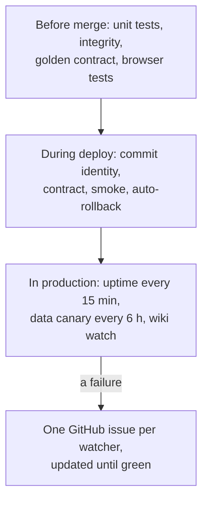

# Quality and observability

Every quality this system promises is backed by something that runs: a CI check, a deploy gate,
or a scheduled probe that opens an issue. This page lists them, in order of what matters most: the
text first, then correct answers, then being up, then being fast and usable. It ends with what is
**not** yet checked automatically.

## The qualities, and what enforces them

| Quality | The promise | Measured by | Enforced where |
|---|---|---|---|
| **Fidelity** | Served scripture is byte-identical to the pinned, proven database | `integrity` (row count, Ang range, `quick_check`, the pin agrees with the contract); the data canary | required check on every PR; every six hours in production |
| **Correctness** | Every route answers exactly as recorded | the golden contract: 274 records replayed over HTTP, plus the Roman-fold and scoring vectors | `python` check, the API image, staging and production deploys |
| **Search quality** | Casual and misspelt quotations still find the line | the casual-quote harness (blocking) and the round-trip harness | `python` check ([harnesses](../search/harnesses-and-golden-vectors.md)) |
| **Availability** | The site and API answer, with every health check true | `uptime.yml`, `/api/health`, `/readyz` | every 15 minutes |
| **Recoverability** | A bad deploy never stays live | the public smoke test after promotion | automatic `vercel rollback` ([rollback](../process/runbooks/rollback.md)) |
| **Speed** | p95 per context within 10% of the recorded baseline | `tools/perf_baseline.py --compare` | a manual release step (not in CI) |
| **Accessibility** | No serious or critical WCAG issues | axe in Playwright; Lighthouse accessibility = 1 on the wiki | `e2e` and the wiki's `docs` job |

## Health, readiness and identity

- **`/api/health`** is the integrity probe. It reports `version`, `db_version`, `commit` and a set
  of checks, and `ok` is false if any check fails: 60,658 lines, 1,430 Angs, full-text search
  answering, the Mool Mantar verbatim at Ang 1, at least 560 occurrences of Ik Onkar, a live
  verification returning an exact match, and the Japji bani mapping. It is never cached.
- **`/readyz`** answers per service: the contexts it serves, any declared table missing from its
  slice, its version and commit. A function whose slice is incomplete refuses to load, and a
  split-mode server refuses to start.
- **`/healthz`** is liveness only.
- **Identity.** Deploys are verified by the **commit** the running API reports, not by the
  version: `wait_for_deploy.py` polls `/api/health` until `commit` equals the deployed SHA and
  every check is true ([ADR-0009](../adr/0009-production-verification.md)).
- **Tracing a request.** Every response carries `X-Request-Id` (reused from the platform's id
  when present) and `X-Service`, the context that answered. The same id is in the access log and
  in `/api/v1` error bodies.

## Watching production

| Watcher | When (UTC) | Checks | On failure |
|---|---|---|---|
| `uptime` | every 15 minutes | `/api/health` all-true; `/`, `/privacy` and `/support` carry their expected text; the wiki and its `/api` rewrite | opens or updates one issue per probe; never redeploys |
| `data-canary` | every 6 hours | 500 sampled lines and 12 Angs (always 1, 712 and 1430) from the production site and the Render standby, byte for byte against the pinned database; then the golden contract | one issue, to be treated as P1 |
| `docs-watch` | every 6 hours | the production wiki: the deployed commit, the smoke checks, the live Playwright suite | one issue, closed when green |
| `deploy-docs` (nightly) | 16:17 daily | the full wiki build and checks on `integration` | one issue, labelled `documentation` |
| `docs-links`, `docs-pins`, `docs-freshness` | weekly | external links, sibling-doc pins, pages due for re-verification | an issue or a pin-bump PR |

Deploy-time failures open their own issues too: a failed production API verification, and a web
rollback after a failed smoke test.

## Logs

The API writes one JSON line per request to standard error, which the host collects:
`{"m": method, "p": path, "s": status, "ms": duration, "id": request_id}`. The query string, IP
address and user agent are never logged, and a test enforces it. An unexpected error adds its
traceback. `SGGS_ACCESS_LOG=0` turns request logging off. There is no tracing SDK or error
service.

## Speed

- **Caching.** Responses that depend only on the immutable database (`ang`, `shabad`, `lines`,
  `bani`, `banis`, `word`, `analytics/*`, `themes/*`, `timing/*`, `forms`, `neighbors`,
  `related`, `line_concepts`) are sent `public, max-age=300, s-maxage=3600` with an ETag and
  answer `If-None-Match` with 304. `health`, `meta`, `random`, `search` and `verify` are
  `no-store`. Each deploy purges the CDN ([versioning and caching](../api/versioning-and-caching.md)).
- **In the process.** One read-only SQLite connection per thread (memory-mapped, 32 MB page
  cache); `/api/meta` and `/api/timing/clock` are built once and kept.
- **Baseline.** [`docs/perf/baseline-2026-09.json`](../perf/baseline-2026-09.json) records p50
  and p95 per route and per context (60 requests per route, 2 in flight, after one warm-up
  request), measured against the Render API from Sydney before the move to functions. Context
  p95 ranged from 365 ms (verify) to 568 ms (reader). Functions scale to zero, and the first
  request after idle pays a cold start of about a second, which the budget excludes
  ([ADR-0011](../adr/0011-api-as-functions-in-the-web-project.md)).

## Not yet wired

- **No performance gate in CI.** `perf_baseline.py --compare` is a manual release step; there
  is no load or soak test ([CI gates](../process/ci-gates.md)).
- **Two search harnesses do not gate.** The round-trip harness runs with `|| true`; the chaos
  harness is not run by any workflow.
- **Some probes still point at the Render standby.** The canary's contract replay, the
  production API verification step and `make verify-prod` default to
  `sggs-knowledge-base.onrender.com`, while production's `/api` is served by the Vercel
  functions. The canary's byte comparison does cover the production site.
- **The website has no Lighthouse run and no page budget** beyond the repository gates' weight
  limits for the Gurbani Soul pages; the wiki has both.
- **`api-image` and `deps` are not required checks**, and `playwright` is required only by the
  deploy workflows, which wait for it.
