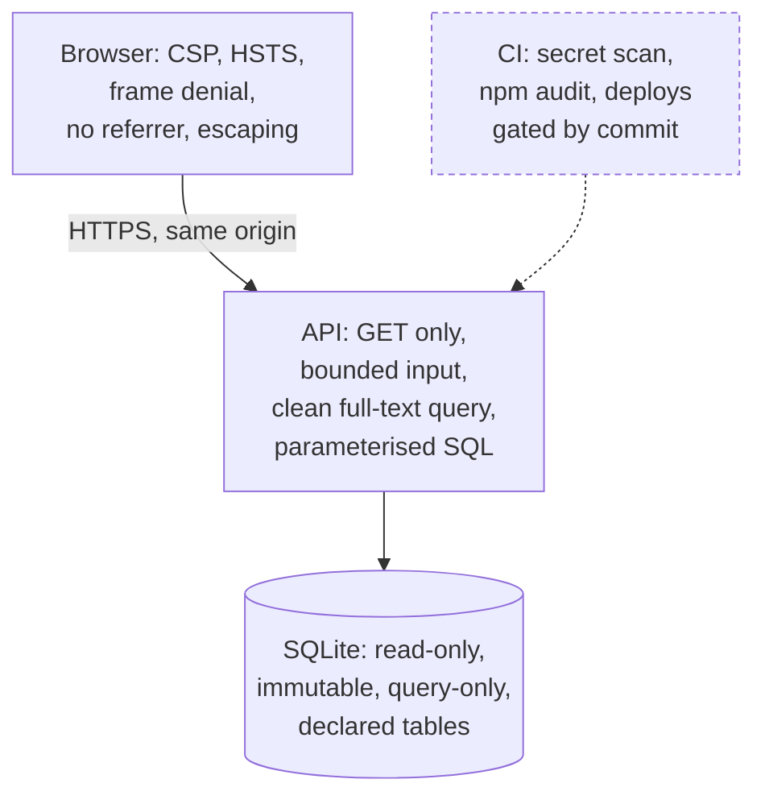

# Security and privacy

The system has an unusually small attack surface, by design. It has no accounts, no logins, no
user data, no request bodies and no writes: the API answers `GET` requests from a database it
opens read-only. What it must protect is **the integrity of the text** and **the privacy of the
people reading it**. This page lists the defences at each layer, what is collected, and the gaps
that are known and open. To report a vulnerability, follow [SECURITY.md](../../SECURITY.md)
(email, not a public issue).

## The API

The same handler serves every host (`serve.py`, and each Vercel function subclasses it).

| Defence | How | Where |
|---|---|---|
| Read-only by construction | only `do_GET` and `do_HEAD` exist, so there are no request bodies | `serve.py` |
| A database that cannot be written | `mode=ro&immutable=1` and `PRAGMA query_only=ON`; the image makes the file `0444` | `sggs/core.py`, `webapp/Dockerfile` |
| Least privilege per context | each context declares its `TABLES`; a test runs every route under an SQLite authorizer that refuses anything else, and a function will not load if its slice lacks a declared table | `webapp/tests/test_declared_tables.py`, `tools/build_api_functions.py` |
| Bounded input | every integer through `_int()` (at most 12 characters, clamped to a range); search `q` at most 300 characters, `limit` at most 200; a verify claim at most 600 characters; id lists at most 300 | `sggs/core.py`, `sggs/search.py`, `sggs/verification.py` |
| No injection | every value bound with `?`; the only built SQL strings are constant columns and `?` lists; full-text input loses `"` and `*` and each token is quoted; FTS columns come from an allowlist | `sggs/search.py`, [invariants](../engineering/invariants.md) |
| No path traversal | static paths are resolved with `realpath` and must stay under the static root; `%`-encoded input is never decoded | `serve.py` `_resolve_static` |
| No leaks on error | a bad parameter is a 400 with a message the code wrote; anything unexpected is a 500 with the fixed body `{"error": "internal server error"}` and the traceback only in the log | `serve.py` |
| Slow clients | 15-second socket timeout; at most 48 worker threads and a backlog of 128 | `serve.py` |
| Response headers | `X-Content-Type-Options: nosniff`, `X-Frame-Options: DENY`, `Referrer-Policy: no-referrer`, HSTS, `X-Request-Id`, `X-Service` on every response | `serve.py` `_sec_headers` |

## The browser

Both sites send their headers from `vercel.json`:

- **Content Security Policy.** `default-src 'self'`, `frame-ancestors 'none'`, `object-src
  'none'`, `base-uri 'self'`. The website allows `'unsafe-inline'` for scripts and styles
  (inline theme and handler code) and one outside origin, the newsletter provider, for
  `connect-src` and `form-action`. The wiki allows inline scripts only by **SHA-256 hash**,
  checked in CI by `npm run check:csp`.
- **Transport and isolation.** HSTS for two years with `includeSubDomains; preload`,
  `Cross-Origin-Opener-Policy: same-origin`, and a `Permissions-Policy` that turns off camera,
  microphone and payment (the website keeps geolocation for its own origin, for the raag clock's
  solar mode).
- **Escaping.** All scripture and API text is escaped by `esc()` before it reaches the page
  ([the website](website.md)).
- **Tests.** `frontend/e2e/csp.spec.ts` loads every route under the enforced policy and expects
  zero violations; the wiki's e2e server sends its production headers to every test.

## CI and the supply chain

- **Deploys only through CI.** Production and staging deploy only from their workflows, after the
  required checks pass on the exact commit, and are verified by the commit the running API
  reports ([ADR-0005](../adr/0005-ci-gated-deploys.md)). The platforms' own Git deployments are
  off.
- **Secrets** live in the `production` and `staging` GitHub Environments (and
  `production-approval` for an optional reviewer). Values are never typed into chat, logs or
  files; one that is pasted anywhere is treated as leaked and rotated
  ([delivery](../engineering/delivery.md)).
- **Least-privilege workflows.** Every workflow declares `permissions:`; most are
  `contents: read`, with `issues: write` only where a workflow files an issue, and
  `contents: write` only for tagging a release.
- **Scans** (`security.yml`): gitleaks on every change (the required `secrets` check);
  `npm audit --audit-level=high` for the website and the wiki; bandit, semgrep and actionlint.
  Dependabot proposes npm, Actions and Docker updates weekly.
- **The dataset is fetched only by pin.** `fetch_dataset.py` downloads the exact object named in
  `dataset.lock.json` and checks its SHA-256 and size; `build_api_functions.py --verify-output`
  refuses a build that would publish the database or the API source as static files.

## Privacy

What is and is not collected, as the public [privacy policy](../../frontend/src/pages/privacy.astro)
states it (every statement there is checked against the code):

- **The app** collects nothing: no accounts, no network connections, no analytics or third-party
  SDKs. Its App Store label is "Data Not Collected". Location for the raag clock is rounded to
  about 1 km and stays on the device.
- **The Knowledge Base pages** load no analytics and set no cookies. Preferences, reading
  positions, pins and a rounded location (about 100 m) stay in the browser's storage.
- **The Gurbani Soul pages** on `gurbanisoul.com` use Vercel Web Analytics: cookieless totals of
  page, referrer, country, browser, OS and device type, with a visitor hash discarded daily.
- **The API log** is one JSON line per request with the method, the path, the status, the
  duration and the request id. It never records the query string, the IP address or the user
  agent; a test fails if a query string appears
  ([ADR-0009](../adr/0009-production-verification.md)). Hosting providers keep their own standard
  logs.
- **The newsletter**, when enabled, sends only an email address to Buttondown, with double
  opt-in ([newsletter runbook](../process/runbooks/newsletter.md)).

## Known gaps

These are open and tracked here so nobody mistakes them for guarantees:

- **Static analysis does not block.** bandit runs with `|| true` and semgrep with
  `continue-on-error`; only the secret scan is a required check. `npm audit` fails its job but
  is not in the branch rulesets.
- **Not every Action is pinned to a SHA.** The deploy and docs workflows are; `web-ci`,
  `security`, `e2e` and several others use version tags. gitleaks is downloaded without a
  checksum check.
- **The website's CSP allows inline script** (`'unsafe-inline'`), unlike the wiki's hash-based
  policy.
- **No application rate limiting.** The API relies on its bounded input and the platform's own
  protection.
- **The API container runs as the image's default user** (no `USER` line in the Dockerfile).
  Production runs as Vercel functions; the container is the Render standby.
- **`frontend/e2e/headers.spec.ts` never runs in CI.** It needs `SMOKE_BASE_URL`, which no
  workflow sets, so nothing checks the website's deployed headers.
- **No written threat model** for the web and API.

New risks go into the [risk register](../risk-register.md).
