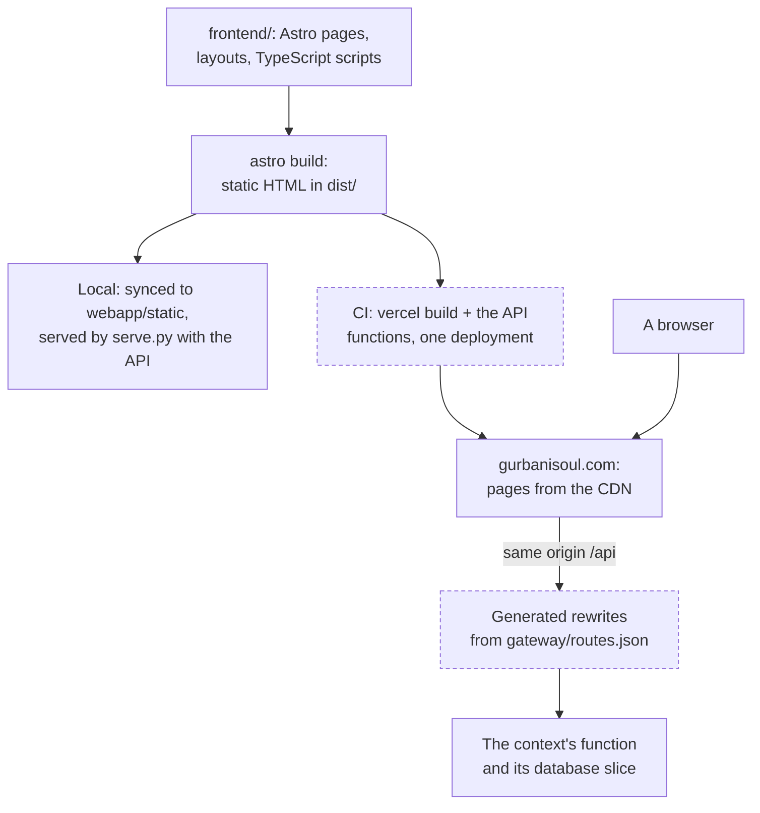

# The website

`gurbanisoul.com` is one static site, built with Astro from `frontend/`. Every page is plain HTML
built ahead of time; there is no server rendering, no client framework and no service worker.
Each page loads a few small TypeScript modules that call the read-only API on the same origin,
`/api/…`, so the browser never talks to another host for scripture. This page explains how
those pieces fit. The operational details (domains, SEO, images, the App Store switch) are in
[the website runbook](../website/README.md).

## Two sites in one build

The build holds two properties that are deliberately kept apart
([brand](../engineering/brand.md)):

| | Layout | Pages | Scripts it loads |
|---|---|---|---|
| **Gurbani Soul** (the app's home) | `Marketing.astro` | `/`, `/features`, `/watch`, `/learn/*`, `/privacy`, `/support` | `landing.ts` only (it never imports the Knowledge Base code), Vercel Web Analytics on `gurbanisoul.com` |
| **Sri Guru Granth Sahib Ji Knowledge Base** | `Base.astro` | `/search`, `/reader`, `/nitnem`, `/browse`, `/themes`, `/lineage`, `/trail`, `/analytics`, `/constellation`, `/raag-clock`, `/divergence`, `/404` | `core`, `panel`, `studytrail`, `saroop` on every page, plus the page's own controller; no analytics |

`frontend/src/routes.ts` is the single list of public routes; the sitemap is built from it, and a
repository gate fails if the sitemap and the built pages disagree.

## The stack

- **Astro 7, static output** (`output: 'static'`, no adapter). Pages are `.astro` files in
  `frontend/src/pages/`; Learn articles are MDX in `src/content/learn/`.
- **No islands.** There are no UI-framework components and no `client:` directives. Interactivity
  is plain TypeScript in `frontend/src/scripts/`, one controller per page. The charts use D3 and
  Chart.js, loaded only on the pages that draw them.
- **Tailwind CSS 4**, CSS-first (`@import "tailwindcss"` and `@theme` in `global.css`, no config
  file). Colours come from the brand tokens; a repository gate checks they match.
- **Fonts are self-hosted.** Sant Lipi (SIL OFL) renders Gurmukhi and is limited by
  `unicode-range` to the Gurmukhi block, so it never downloads for an English-only page; the
  marketing pages add Source Serif 4. Both are preloaded.
- **Node 22** (`.nvmrc`), used for the build only.
- **Open Graph cards** are drawn at build time with satori and resvg (`src/pages/og/`).

## How a page talks to the API

Every call goes through `api(path)` in `core.ts`, which fetches `/api/` + path on the same origin.
Because the API is same-origin, there is no CORS and no API host in the page; the rewrites in
`frontend/vercel.json`, generated from `gateway/routes.json`, send each prefix to its context's
function ([bounded contexts and the gateway](bounded-contexts-and-gateway.md)).

| Page | Calls |
|---|---|
| Every Knowledge Base page | `meta` (kept for the session), `random`, `shabad/{comp_id}`, `neighbors`, `lines`, `line_concepts` |
| `/search` | `search`, `verify` |
| `/reader` | `ang/{n}` (and prefetches the next and previous Ang), `neighbors`, `timing/clock` |
| `/nitnem` | `banis`, `bani/{key}` |
| `/lineage`, `/analytics` | `analytics/*`, `themes/network`, the build-time `contributors.json` |
| `/constellation` | `analytics/constellation` |
| `/raag-clock`, `/divergence` | `timing/clock`, `timing/divergence` |

The Gurbani Soul pages make no API calls.

## Rules the scripts keep

- **Everything from the API is escaped.** Scripture and API text reach `innerHTML` only through
  `esc()` in `core.ts`. This is one of the [engineering invariants](../engineering/invariants.md).
- **Saroop is display-only.** `saroop.ts` draws the traditional subjoined-ya form in the rendered
  glyphs only; the stored text, search, the API and Copy stay verbatim (a copy handler strips the
  display markup). It is on by default and remembers an explicit choice.
- **The pinned verse is read from the API model.** The Study Trail pins verbatim text from the
  API (`data-gm`), never from the rendered glyphs, which saroop may have changed.
- **State stays in the browser.** Preferences (theme, transliteration, text size, saroop, raag
  clock mode), reading positions and pinned verses (at most 500) live in `localStorage`; the
  `meta` and timing responses and the Semantic Trail path live in `sessionStorage`. There are no
  cookies and no accounts; the [privacy policy](../../frontend/src/pages/privacy.astro) describes
  the same set.

## Build, test and deploy

| Step | Where | What |
|---|---|---|
| Build | `npm run build` | `astro build` into `frontend/dist/` |
| Local serving | `npm run sync` | copies `dist/` into `webapp/static/` for `serve.py` (a backup goes to `static.bak/`) |
| Checks | `web-ci` (`frontend` job) | build, `astro check` (advisory), the pahar vectors |
| Repository gates | `web-ci` (`python` job) | SEO, sitemap, RSS, the external-request allowlist, no secrets in the source, theme tokens, page-weight budgets for the Gurbani Soul pages |
| Browser tests | `e2e` (`playwright` job) | the Playwright specs in `frontend/e2e/` against `serve.py`: the CSP with zero violations on every route, axe on the main pages, the reader and search smoke |
| Staging | `deploy-staging.yml` | build the API functions, `vercel build`, deploy, alias `sggs-staging.vercel.app`, purge the CDN, then `@smoke`, the gateway probes and the golden contract |
| Production | `deploy-production.yml` | the same build deployed unaliased, verified, promoted to `gurbanisoul.com`, then `@smoke` on the public domain; a failure rolls back automatically ([deploy runbook](../process/runbooks/deploy.md)) |

The Vercel project's own Git deployments are off; only these workflows deploy. The security
headers the site sends are on [security and privacy](security-and-privacy.md).
