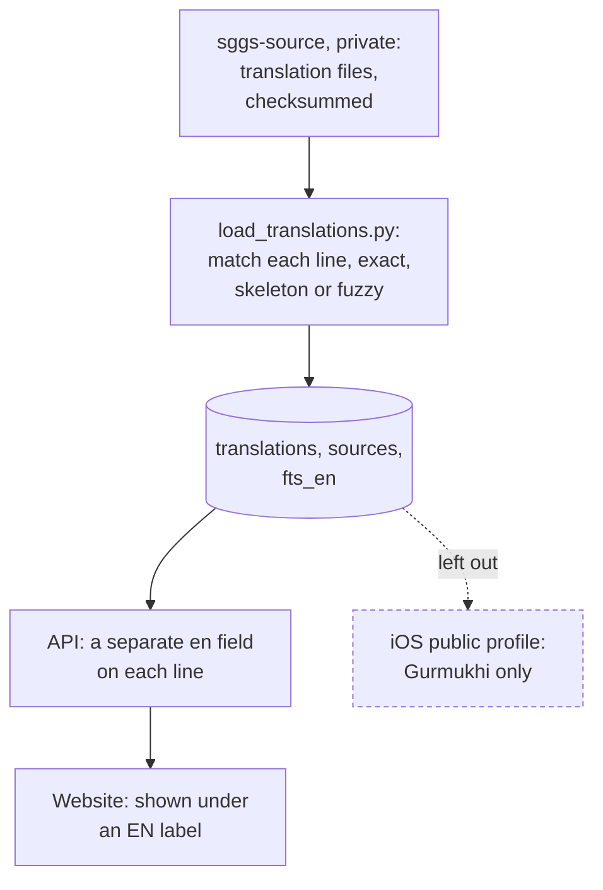

# The English translation layer

Beside the Gurmukhi, the database carries an English translation by **Dr. Sant Singh Khalsa**.
It is a separate layer: its own table, its own index, its own field in the API, and a visible
"EN ·" label on the site. It never replaces, edits or mixes with the Gurmukhi, and a translation
is never presented as the original ([invariants](../engineering/invariants.md)). 58,039 of the
60,658 lines (95.7%) have one.

## Where it comes from

Two sources are registered in the `sources` table, both the same translator:

| `source` | Rows | Attribution (as stored) | Terms (as stored) |
|---|--:|---|---|
| `ssk-shabados` | 57,394 | via the ShabadOS open database, release 4.8.7 | open data with attribution; the translation author must be credited |
| `ssk-banidb` | 645 | via BaniDB | personal, local, non-commercial use with attribution |

The input files are not in any public repository. sggs-data's `scripts/data/fetch_translations.sh`
downloads them from a private release (`translations-en-v1` in `sggs-source`) and checks every
file against the committed `pipeline/translations.SHA256SUMS`; `rebuild_all.sh` refuses to start
if any file is missing or altered. The ShabadOS file is loaded first; the older BaniDB files
(Angs 1–13 and 917–922) are loaded second and replace ShabadOS rows for those lines.

## How a translation finds its line

The source files pair a Gurmukhi line with its English. `load_translations.py` finds the matching
line in the corpus on the same Ang or a neighbouring one, comparing a normalised form (NFC,
punctuation, digits and the rahao label removed):

| `match_quality` | Rule | Rows |
|---|---|--:|
| `exact` | the normalised text is identical | 56,195 |
| `skeleton` | the consonant skeleton (vowel signs removed) matches exactly one line | 526 |
| `fuzzy` | similarity of at least 0.92 | 1,318 |

Anything below that is skipped rather than attached to the wrong line, and the first match for a
line wins. The Gurmukhi is only read here, never written: the corpus is compared, not changed.

**Coverage.** 2,619 lines have no English: 2,287 are headings and 332 are verse lines, spread over
142 Angs (Ang 213 has the most, 19). Those lines are returned without an `en` field.

## In the API and on the site

- **API.** Lines that have a translation carry it as `en`: in search results (every mode), in
  `/api/ang`, `/api/shabad`, `/api/bani` (Granth lines only; lines from outside the Granth never
  get English) and `/api/neighbors`. There is no per-line source field; `/api/meta` and
  `/api/health` report the total as `translations_en`. `attach_translations` in
  `webapp/sggs/core.py` adds the field from the `translations` table and does nothing if the
  table is absent.
- **Website.** Every surface renders the English in its own escaped element with `lang="en"`,
  labelled "EN ·" by the stylesheet, below the Gurmukhi. The footer credits the translator
  whenever `translations_en` is above zero. Learn articles show Gurmukhi only, by design.
- **iOS.** The App Store build uses the `public` profile, which leaves out `translations` and
  `fts_en`; the app then hides its English toggle, English search and credit line. A build with
  English (`personal` profile) is refused by `check_release_license.sh` unless the licence file
  says `LICENSED: true` ([the iOS database pair](../ios/db-pair-and-launch-integrity.md)).

## Searching the English

`fts_en` is an FTS5 index over `translations.text` with the default `unicode61` tokenizer:
case-insensitive, no stemming, stop words indexed.

- **`mode=english`** searches only this index. Each word is quoted and the words are joined with
  AND, so every word must appear; there is no prefix matching (`*` is stripped), no phrase
  search and no stemming ("forgive" and "forgiveness" are different words). Results are ranked by
  plain BM25.
- **`mode=auto`** reaches English only when the query is in Latin script and the earlier tiers
  (theme names, transliteration, the seeker lexicon, variants) found nothing. It comes before the
  Roman fold on purpose, so an English word reaches the translation instead of colliding with a
  folded Gurmukhi word ([modes and tiers](../search/modes-and-tiers.md)). Some English words
  never get here because the seeker lexicon maps them first (for example "mercy" and "love").
- The response names the tier in `mode` (`english` or `english-translation`). One quirk: when
  every tier finds nothing, `mode` can still read `english-translation` with zero results. Treat
  `mode` as a hint, as the modes page says.

The golden contract pins English behaviour: eight `mode=english` queries (including empty and
punctuation-only input) and three auto queries that resolve to the translation.

## Licence status

This section records what the repositories say; it is not legal advice, and the decision rests
with the owner.

- The `sources` table stores the terms above. The platform's `NOTICE.md` restricts the English to
  personal, local, non-commercial study and says a written licence from the rights holder is the
  only route to public or commercial distribution.
- The iOS App Store build therefore ships without English, enforced by the licence gate, and the
  support page tells users why.
- The public website and API serve the English today. That is an open item in the
  [risk register](../risk-register.md) ("English translation is not licensed for distribution").

## Known issues

- **The footer credit names BaniDB** ("via BaniDB"), while 57,394 of the 58,039 rows come via
  ShabadOS; the README names ShabadOS correctly.
- **Checksummed but never loaded.** sggs-data's checksum list includes files for Angs 262–296 and
  an `en_repair` file that no load step picks up (the load globs match only the other files).
- **No per-line provenance in the API.** A client cannot tell which source a given `en` came from.
