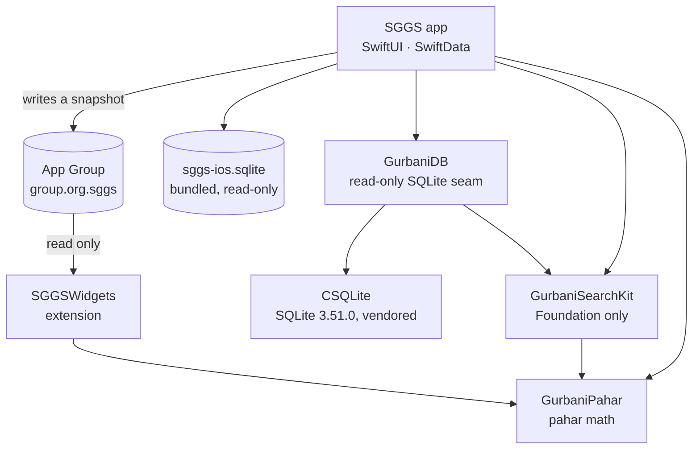

# App architecture

The app is about 22,000 lines of Swift in one Xcode project generated from `ios/App/project.yml`
(XcodeGen), with iOS 17 as the minimum. It has no third-party dependencies: the only package is its
own, `GurbaniSearchKit`, and the only C code is a pinned copy of SQLite. Everything below is read
from `gurbani-soul-ios` at the commit this wiki pins.

## The package: three modules and a pinned SQLite

`ios/Packages/GurbaniSearchKit` holds everything that must behave exactly like the platform:

| Module | Depends on | What it holds |
|---|---|---|
| `GurbaniSearchKit` | `GurbaniPahar`, Foundation | The search waterfall (`SearchEngine`), the verification ladder (`VerifyEngine`, `SequenceMatcher`), the Roman fold (`RomanNorm`), the seeker lexicon, and the reader, bani, timing and insight models. No SQLite and no SwiftUI, so it is tested on macOS as well as iOS. |
| `GurbaniDB` | `GurbaniSearchKit`, `CSQLite` | The read-only seam: `SQLiteCandidateSource` and its readers for the corpus, banis, timing and analytics. It opens the database as `mode=ro&immutable=1` with `query_only`, exactly as the server does. |
| `GurbaniPahar` | nothing | The pahar (watch of the day) arithmetic for the Raag Clock, kept separate so the widget extension links kilobytes rather than a database engine. |
| `CSQLite` | nothing | The SQLite 3.51.0 amalgamation, pinned by hash, with FTS5. |

The pinned SQLite is what makes the Swift port provable. Full-text tokenisation and `bm25` ranking
differ between SQLite versions, and iOS ships whichever version it ships. By compiling the same
version that built the corpus index and the golden vectors, the app ranks results identically on
every device, and [the parity suites](contract-and-parity.md) can prove it byte for byte.

<!-- sggs:code file="ios/Packages/GurbaniSearchKit/Package.swift" lines="1-20" repo="gurbani-soul-ios" -->
Source: `ios/Packages/GurbaniSearchKit/Package.swift` in gurbani-soul-ios, read at the pinned commit.

## One actor answers the API's routes

The app has no server to call. `CorpusActor` owns the database and the two engines, and exposes one
method for almost every API route, so a screen asks the actor what a web page asks the API:

| API context | Routes | `CorpusActor` |
|---|---|---|
| reader | `ang`, `shabad`, `random`, `meta`, `banis`, `bani` | `ang(_:)`, `shabad(compId:)`, `randomHukam()`, `meta()`, `banis()`, `bani(key:variant:)` |
| search | `search` (every mode, including theme) | `search(_:mode:limit:offset:)`, `theme(_:)`, `english(forLine:)` |
| verify | `verify` | `verify(_:ang:)` |
| insights | `analytics/*`, `themes/network`, `neighbors` | `authorAnalytics()`, `raagAnalytics()`, `themeNetwork(…)`, `constellation(…)`, `resonance(…)`, `progression(…)`, `vaars()`, `vaar(id:)`, `authorProfile(_:)`, `neighbors(lineId:)` |
| knowledge | `timing/*`, `forms` | `timingClock()`, `timingRaag(name:)`, `timingDivergence()`, `forms(compId:)` |

Being an actor, it serialises every query on one connection, off the main thread. Opening it
detects the database's **capabilities** (whether the translation, timing and bani tables exist), and
the screens hide what the bundled profile lacks: the public build has no English layer, so its
English search mode and English toggle never appear
([database pair](db-pair-and-launch-integrity.md)).

<!-- sggs:code file="ios/App/Sources/Data/CorpusActor.swift" lines="26-35" repo="gurbani-soul-ios" -->
Source: `ios/App/Sources/Data/CorpusActor.swift` in gurbani-soul-ios, read at the pinned commit.

## The app target

`ios/App/Sources` is organised by role:

| Folder | Files | Holds |
|---|--:|---|
| `App` | 5 | The entry point, the `AppContainer` (the actor, the launch-integrity result, the SwiftData container, the router), the tab bar and the theme. |
| `Navigation` | 1 | `Router`: the selected tab, the one modal host every tab shares, and the `sggs://` deep-link handler. |
| `Screens` | 24 | One SwiftUI view per screen ([what the app does](what-the-app-does.md)). |
| `Components` | 28 | Shared views: a verse row with its actions, Gurmukhi text, charts, the reader's settings. |
| `Data` | 14 | Launch integrity, the corpus actor, the Nitnem schedule and reminders, Spotlight, the Live Activity, local diagnostics. |
| `Persistence` | 3 | The user's own data: saved verses (SwiftData), Nitnem progress and the Nitnem plan (JSON). |
| `Intents` | 1 | App Intents and the Siri phrases. |

At launch the app builds the container, then in order: checks the database against its certified
manifest, loads the metadata, writes the widget snapshot and plans any reminders. **Nothing is shown
from the database until the integrity check passes**; the tab bar replaces a "Verifying" view only
then ([launch integrity](db-pair-and-launch-integrity.md)).

## The widget extension

`SGGSWidgets` links only `GurbaniPahar` and never opens the database. After each launch the app
writes `widget-snapshot.json` to the App Group (a Hukam verse with its Ang, the pahar-to-raag
tables, the clock mode and the set metadata), then asks WidgetKit to reload. The widgets read that
snapshot and the Nitnem progress file, and write nothing. The code shared by the app and the
extension lives in `ios/App/Shared`.

## Tests

| Suite | Where | Runs |
|---|---|---|
| Package tests (`GurbaniSearchKitTests`, `GurbaniDBTests`) | `ios/Packages/GurbaniSearchKit/Tests` | `swift test`, including the golden-contract parity suites |
| App unit tests (`SGGSTests`, 31 files) | `ios/App/Tests/Unit` | on the simulator |
| UI tests (`SGGSUITests`) | `ios/App/Tests/UI` | on the simulator, including the screen-capture test |
| Source and configuration gates | `ios/tests/` (`test_ios_gates.py` and others) | Python, in the `ci` workflow: no network code, no `try!` or forced casts, the privacy manifest matches the code, no background modes |

The app repository's `iOS fidelity gate` workflow runs the package tests on macOS (`parity`) and
the app's unit and UI tests on a simulator (`app`); the Python gates run in its `ci` workflow, next
to `security` and `pr-hygiene`. Uploads go through the separate
`iOS TestFlight upload` workflow or `make testflight`
([how the app takes a release](how-the-app-takes-a-release.md)).
