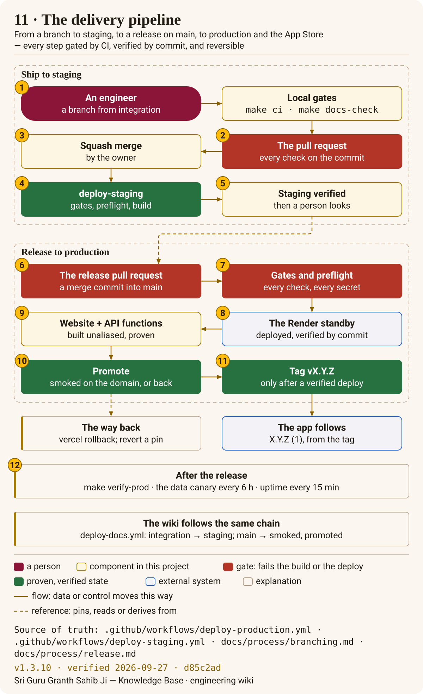

# Ship and operate

A change travels one road. It starts on a branch from `integration`, passes every gate on a pull
request, and is merged by the owner, which deploys **staging**. A release merges `integration` into
`main`, which runs the **gated production deploy**: every required check on the exact commit, the
API and the website proven before anyone can reach them, then promotion, then the tag. The app
follows from that tag. Nobody deploys by hand, and every step can be undone.

## How it works

<!-- sggs:cards -->
- [Branching and delivery flow](branching.md) — the branch model, which pull requests squash and which merge, and why.
- [Environments](environments.md) — local, staging and production side by side: hosts, the API, data, protection, who deploys.
- [CI gates](ci-gates.md) — what every workflow and job proves, and which a merge requires (poster 10).
- [Release process](release.md) — the steps from a green `integration` to a tagged production release.

## Runbooks

<!-- sggs:cards -->
- [Deploys](runbooks/deploy.md) — the CI-gated pipeline gate by gate, its secrets, and how to read a failed run.
- [Rollback](runbooks/rollback.md) — the website and the API together, the Render standby, a dataset, the app.
- [Moving production to functions](runbooks/services-production.md) — the per-context cut-over, gated on the performance baseline and the data canary.
- [The docs site](runbooks/docs-site.md) — keeping docs.gurbanisoul.com honest: deploys, watchers, pins, reviews.
- [Support inbox](runbooks/support-inbox.md) — the public support address and how mail to it is handled.
- [Launch-notice sign-up](runbooks/newsletter.md) — the sign-up on the landing page and its privacy rules.

## The handbook

The rules behind all of this — the invariants, local setup, delivery and versioning, brand and
domains, the release timeline — are the [engineering handbook](../engineering/README.md).
