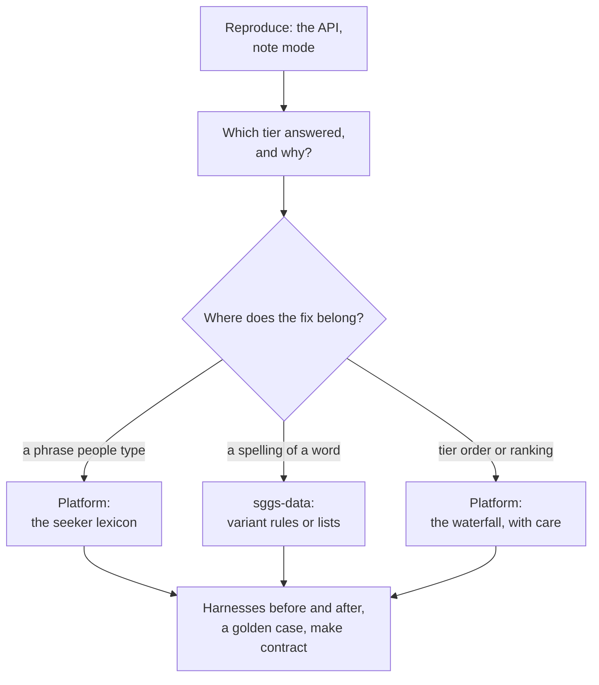

# Debugging a search result

A report usually reads "I searched for X and got the wrong line", or no line at all. Search is a
waterfall of tiers tuned across the whole Granth, so the fix is rarely where the symptom is. This
playbook finds which tier answered, why, and where a fix belongs, then proves the fix did not cost
recall elsewhere.



## 1. Reproduce it

Ask the API exactly what the site asked. Production works; locally, run `serve.py`:

```bash
curl -s 'https://gurbanisoul.com/api/search?q=waheguru&mode=auto&limit=5' | python3 -m json.tool | head -30
```

Note four things: the `mode` field, the number of `results`, the `ang` and `id` of the first few,
and whether the report was made with a specific mode chip (the site passes `mode`). `/api/search`
is never cached, so what you see is what the code does now.

## 2. Read which tier answered

`mode` names the tier that produced the results. It is a debugging aid, not an API contract
([modes and tiers](modes-and-tiers.md)):

| `mode` | What happened | Look at |
|---|---|---|
| `gurmukhi`, `gurmukhi-skeleton` | Gurmukhi input, matched exactly or on the consonant skeleton | the query's own characters (a stray Latin letter makes it `mixed-script`) |
| `roman` | the transliteration index matched every word | usually right; if the wrong line, it is ranking (refrains, repeated lines) |
| `first-letters` | two or more words of three letters or fewer were read as first letters | a short query that was meant as words |
| `seeker-lexicon (<term>)` | a whole-query entry in `SEEKER_LEXICON` | the entry's terms ([variants and the lexicon](variants-and-lexicon.md)) |
| `variant-match` | the variant index matched, possibly all words but one | the variants for each word, below |
| `english-translation`, `english` | the English layer | whether the line has English at all ([the translation layer](../data/translation-layer.md)) |
| `passage-match (…)` | the words span consecutive lines | whether the query crosses a line break |
| `roman-spelling-tolerant` | the Roman fold matched | fold collisions, below |
| `theme` | a theme name, or the single-word theme fallback | the `concept` block in the response |
| `… (honorifics dropped)` | "ji", "sahib" and similar were removed and the rest retried | the words that remained |

**Zero results.** When nothing matches, `mode` is simply the last tier tried (often
`english-translation`); it does not mean English was the right place.

## 3. Find the cause

Inspect the pieces in process, against the pinned database (`make dataset` first):

```bash
cd webapp && SGGS_DB=../db/sggs.sqlite python3 -c "
from sggs.search import do_search
from romannorm import roman_norm
r = do_search('waheguru', 'auto', 5, 0)
print(r['mode'], [x['id'] for x in r['results']])
print(roman_norm('waheguru'))
"
sqlite3 'file:db/sggs.sqlite?mode=ro' "SELECT variant, translit, freq, score, rtype FROM variants WHERE variant = 'waheguru'"
sqlite3 'file:db/sggs.sqlite?mode=ro' "SELECT 1 FROM canon_tokens WHERE token = 'waheguru'"
```

The usual causes, in the order they are met:

- **An earlier tier answered.** A lexicon key that is also a word of the transliteration is
  answered by `roman` first; a word that is also a theme name is answered as a theme. Short
  queries of two or more words of three letters or fewer are read as first letters.
- **The spelling is unknown.** No row in `variants`, not a word in `canon_tokens`, and the fold
  finds nothing useful. The fix is a spelling (sggs-data) or a lexicon entry (platform).
- **The fold collides.** The fold maps different spellings to one key on purpose; a very short
  fold matches many lines. Even nonsense can return a line: `xqzv` folds to `gjv`, a real key,
  and gets a `variant-match`. A single-character fold is ignored as too weak.
- **English beat the transliteration, or the reverse.** English is tried only after the
  lexicon and variants, so an English word that is also a variant spelling never reaches the
  translation. A line with no English (headings, 332 verse lines) cannot be found by English
  search.
- **Ranking, not matching.** Refrains are printed several times with only their numbering
  changed; the round-trip harness counts most of its rank-2 results there. That is expected.
- **Input limits.** A query over 300 characters is a 400; the variant tier ignores queries of
  more than ten words; `limit` is capped at 200.

`/api/word` is a separate lookup of one **Gurmukhi** word in `word_freq`; a Roman word always
returns zero there.

## 4. Fix it in the right place

| The cause | The fix | Where |
|---|---|---|
| a phrase people type maps to the wrong or no line | a `SEEKER_LEXICON` entry (check first that it is not already a transliteration word) | platform, `webapp/sggs/search.py` |
| a word's spelling is missing | a reviewed typo or loanword spelling, or a rule | sggs-data, then a pin bump ([variants and the lexicon](variants-and-lexicon.md#changing-a-spelling)) |
| the fold is too eager or too strict | a fold change, which must stay byte-identical in its three homes | platform and sggs-data together ([the Roman fold](the-roman-fold.md)) |
| a tier order or ranking weight | a waterfall change, the riskiest kind | platform, with the harness numbers in the PR |

Never fix a search problem by changing the text: the Gurmukhi and its transliteration are
verbatim and proven ([the integrity chain](../data/integrity-chain.md)).

## 5. Prove it

1. Run `make harnesses` before and after, and compare with
   [where the numbers stand](harnesses-and-golden-vectors.md#where-the-numbers-stand). For a
   change that could affect odd input, run the chaos harness too (it needs `serve.py` on port
   7777).
2. Add the query to the search cases in `tools/gen_golden_vectors.py` (`search_vectors()`, a
   `(query, mode)` pair), run `make contract`, and review the diff of
   `contract/golden_search.ndjson`: every changed record is a behaviour change you are signing
   for.
3. Open the pull request with the before-and-after harness summaries and the contract diff. After
   release, the app re-vendors the contract and its Swift port must match.
