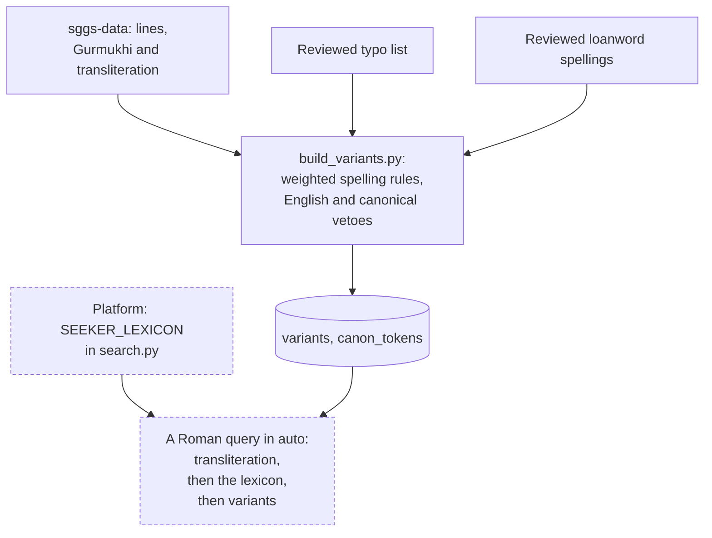

# Variants and the seeker lexicon

People type Gurbani in Roman letters in many ways: `gyan`, `gian` and `giaan` are one word;
`waheguru` is typed far more often than the transliteration's `vaahiguroo`; some type an English
word such as "mercy". Two mechanisms bridge that gap, and they live in different places:

- the **variant index** (`variants` table): spellings generated for every word of the Granth, built
  by sggs-data with the database;
- the **seeker lexicon** (`SEEKER_LEXICON`): a short, hand-kept map in the platform's code from
  whole queries people type to transliteration terms or a theme.

Neither changes the text. Both only decide which verbatim lines a query finds.

## The variant index

Built by sggs-data's `pipeline/build_variants.py` during every rebuild. It is deterministic: the
same corpus always gives the same table.

1. **Pair.** Each verse line's Gurmukhi words are paired with the words of its transliteration;
   misaligned lines are skipped. A word's canonical spelling is its most frequent transliteration.
2. **Generate.** Weighted spelling rules (long and short vowels, aspirates, `v`/`b`, a final `-ai`
   written `-a`, dropped nasals and others) are applied up to three deep; a variant's score is the
   product of its rules' weights. At most 15 variants are kept per word.
3. **Veto.** A variant is dropped if it is shorter than two characters or not alphanumeric, if it
   is an English word (any word that appears at least twice in the English translation, plus a
   short fixed list), or if it is itself the canonical spelling of another word — so a variant
   can never hijack a real word.
4. **Add the reviewed layers.** Two lists proposed with an assistant's help and each checked by
   a deterministic gate plus review: common typos (`pipeline/variants_typo.jsonl`) and loanword
   spellings (`pipeline/enrichment/approved/`). Their scores are scaled down (confidence × 0.6),
   so they never outrank a rule variant.

What the pinned database holds:

| `rtype` | Rows | Score range | Where it comes from |
|---|--:|---|---|
| `rule` | 78,707 | 0.296–0.9 | the weighted rules |
| `llm` | 1,047 | 0.36–0.594 | the reviewed loanword spellings |
| `typo` | 86 | 0.18–0.57 | the reviewed typo list (99 proposed, 86 pass the vetoes) |

Each row is `variant → gurmukhi, translit, freq, score`. Beside it, `canon_tokens` holds every
distinct word of the transliteration, so search can tell a correctly spelt word from a
misspelling. The full columns are in the [data dictionary](../data/data-dictionary.md#variants).

## The seeker lexicon

`SEEKER_LEXICON` in `webapp/sggs/search.py` maps a whole query (lower-cased) to what the seeker
most likely means. It has 106 entries:

- **100 map to transliteration terms**, tried in order. For example `mercy` maps to `daiaa`, then
  `kirapaa`; `satnam` to `sat naam`, then `satinaam`; `waheguru` to `vaahiguroo`. The answer's
  `mode` reads `seeker-lexicon (<term>)`.
- **6 map to a theme** (`ego`, `liberation`, `love`, `moksha`, `salvation`, `truth`), answered like
  the theme mode.

The lexicon is code, not data: it ships with a platform release, not with a dataset.

**Order matters.** In `auto` mode a Roman query tries, in order: an exact theme name, first
letters, the transliteration index, the **lexicon**, the **variant index**, then the English
translation and the later tiers ([modes and tiers](modes-and-tiers.md)). So a lexicon key that is
itself a word of the transliteration is answered by the transliteration tier and never reaches
the lexicon. Of the 106 keys, 20 are shadowed this way (short words such as `ka`, `ki`, `ko`,
`me`), and 3 (`darshan`, `seva`, `satguru`) are also theme names and resolve as themes first.

## How the variant index is used

`variant_search` handles queries of up to ten words. For each word it builds a set of
alternatives:

- up to three variant matches, most frequent and highest scoring first;
- the word with a trailing vowel retried and a nasal trimmed, and English suffixes (`-ing`, `-ed`,
  `-es`, `-er`, `-s`) stripped;
- the word itself if `canon_tokens` knows it, and its long-vowel twin;
- the first two lexicon terms for the word, if any;
- up to five exact matches of the word's [Roman fold](the-roman-fold.md).

A word whose fold is a single character is too weak to use and is skipped. The sets are joined
with AND into one ranked full-text query. When there are three or more words (or a repeated
mantra of two), a fallback accepts a line that matches all but one of them.

## Changing a spelling

| To change | Edit | Repository | Then |
|---|---|---|---|
| a lexicon entry | `SEEKER_LEXICON` in `webapp/sggs/search.py` | platform | re-run the harnesses; add a search case to the golden contract; `make contract` |
| a spelling rule or the English veto | `pipeline/build_variants.py` | sggs-data | rebuild behind the scripture gates (re-baseline: `variants` is a fingerprinted table), release, bump the pin here |
| a typo or loanword spelling | `pipeline/variants_typo.jsonl`, or the enrichment blocks and `enrich_orchestrator.py merge` | sggs-data | as above |

A new lexicon key should be checked against the transliteration first: if it is already a word of
the Granth, the lexicon will never see it. Every change is judged by the harnesses corpus-wide,
not by the one query that prompted it ([harnesses and golden vectors](harnesses-and-golden-vectors.md));
[debugging a search result](debugging-a-search-result.md) walks through the loop.

There are no unit tests for `SEEKER_LEXICON` or `variant_search` themselves; the golden contract
(four lexicon cases, four variant cases) and the harnesses are what protect them.
